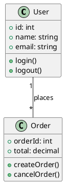
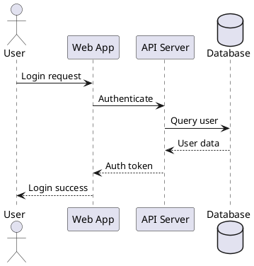
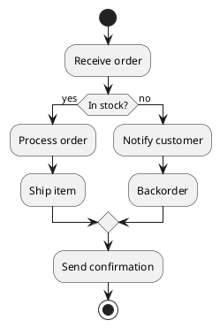
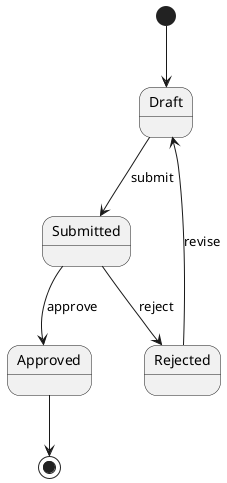
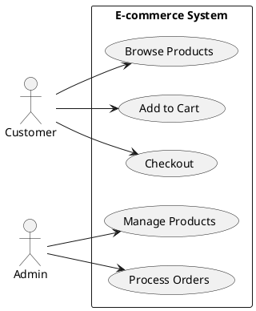
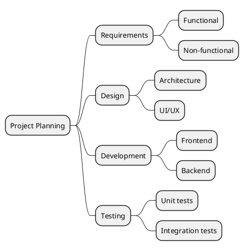
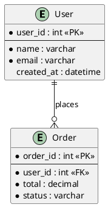
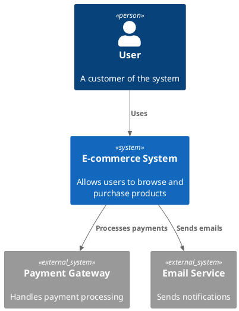
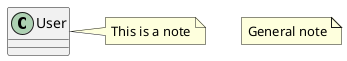

# PlantUML DSL Reference

PlantUML is a text-based DSL for creating UML diagrams. Use `convert_plantuml_to_drawio` tool to convert PlantUML code to Draw.io XML.

## Supported Diagram Types

- Class diagrams
- Sequence diagrams
- Activity diagrams
- State diagrams
- Use case diagrams
- Mind maps
- Entity-Relationship (ER) diagrams
- Deployment diagrams
- C4 architecture diagrams

## Basic Syntax

### Class Diagram


### Sequence Diagram


### Activity Diagram


### State Diagram


### Use Case Diagram


### Mind Map


### ER Diagram


### C4 Context Diagram


## Styling

### Colors and Themes
```plantuml
@startuml
skinparam backgroundColor #EEEBDC
skinparam handwritten true

skinparam class {
  BackgroundColor PaleGreen
  BorderColor DarkGreen
  ArrowColor SeaGreen
}
@enduml
```

### Notes


## Usage Tips

1. **Always wrap code** in `@startuml` / `@enduml` (or `@startmindmap` / `@endmindmap` for mind maps)
2. **Use stereotypes** `<<stereotype>>` for classification
3. **Relationship symbols:**
   - `--` association
   - `-->` directed association
   - `<|--` inheritance
   - `*--` composition
   - `o--` aggregation
4. **Visibility modifiers:**
   - `+` public
   - `-` private
   - `#` protected
   - `~` package

## Examples

- "Create a class diagram for a blog system with User, Post, and Comment"
- "Draw a sequence diagram for user authentication flow"
- "Generate an activity diagram for order processing"
- "Create a C4 context diagram for a microservices architecture"
