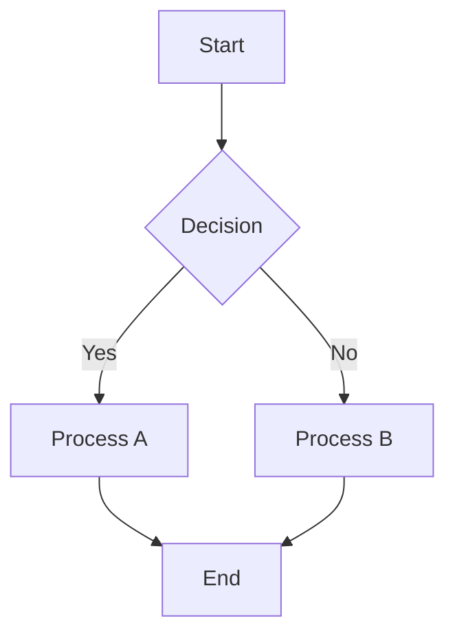
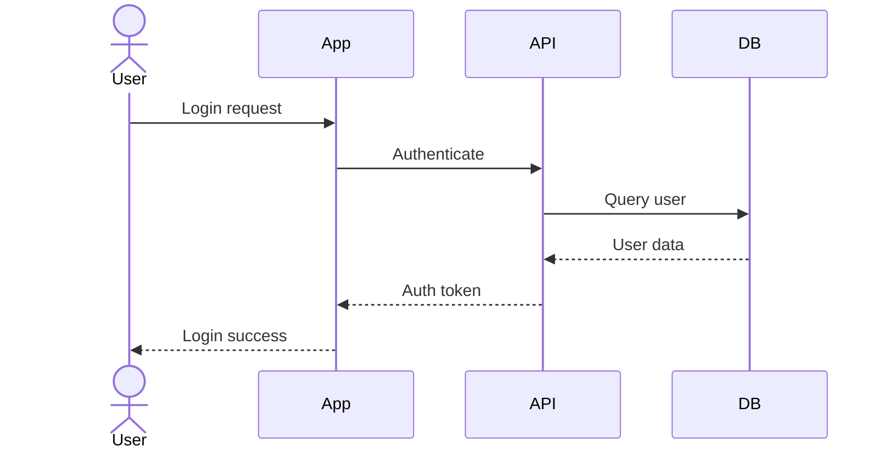
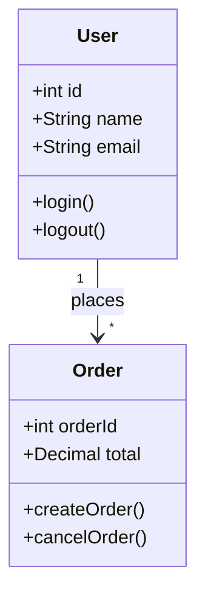
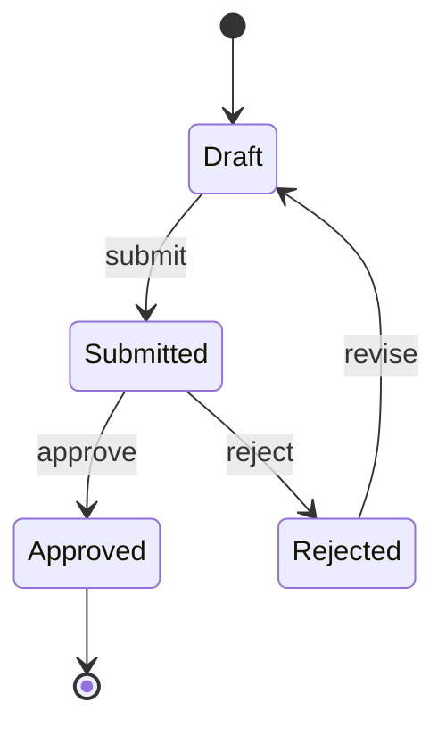
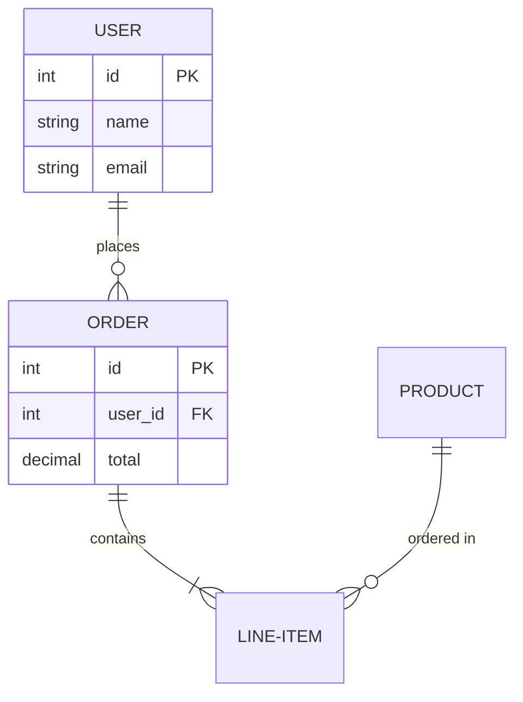
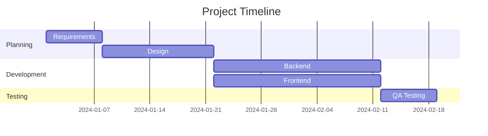
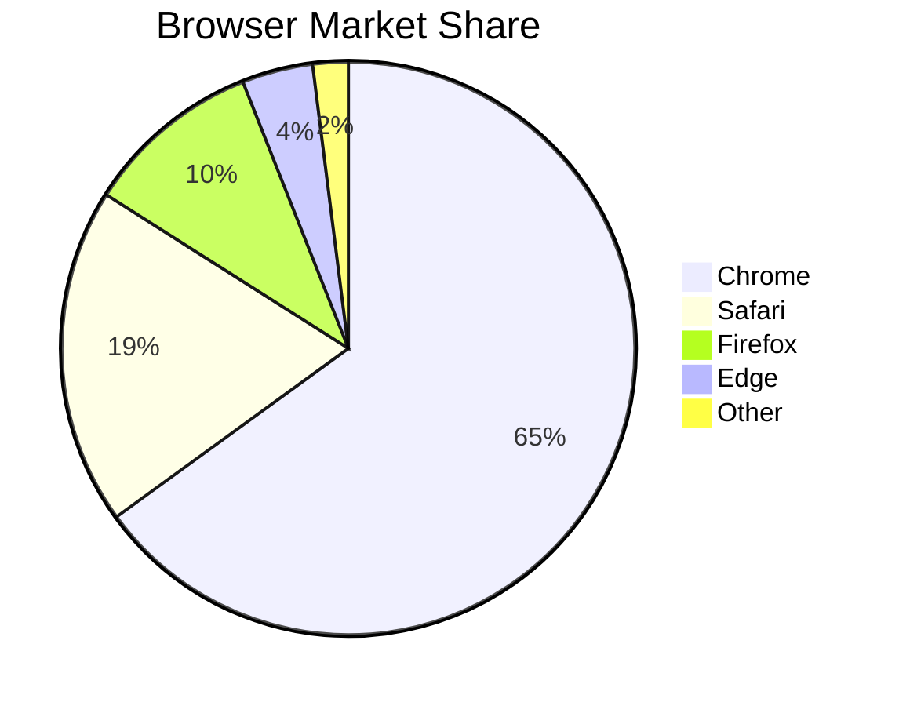
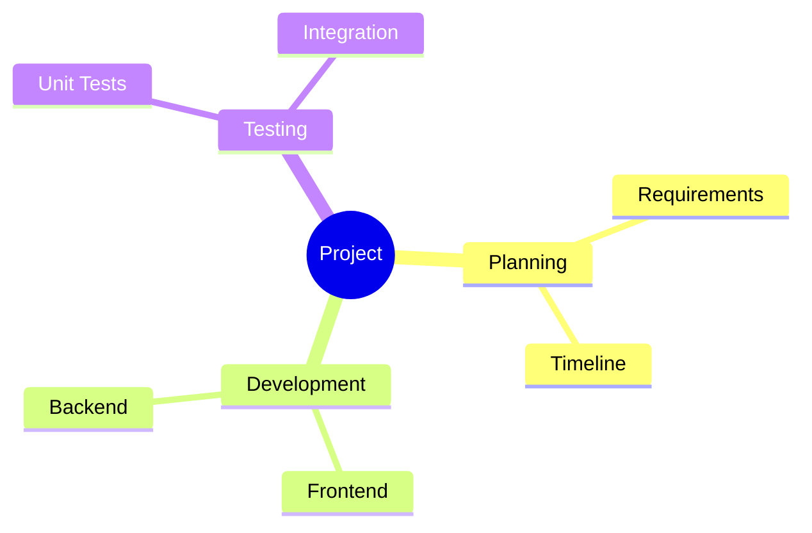
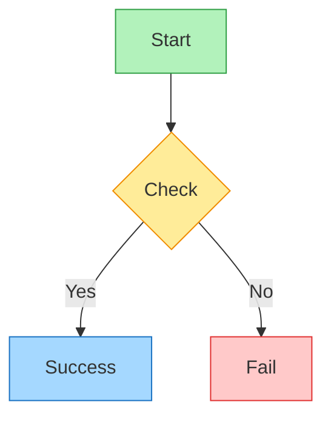
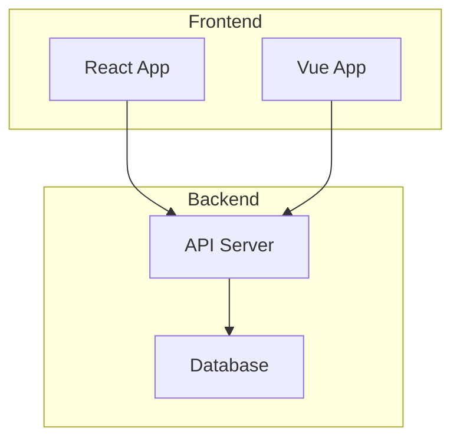

# Mermaid DSL Reference

Mermaid is a text-based DSL for creating diagrams. Use `convert_mermaid_to_excalidraw` tool to convert Mermaid code to Excalidraw elements with hand-drawn style.

## Supported Diagram Types

- Flowchart / Graph
- Sequence Diagram
- Class Diagram
- State Diagram
- Entity-Relationship Diagram
- Gantt Chart
- Pie Chart
- Mind Map

## Basic Syntax

### Flowchart

**Direction options:**
- `TD` / `TB` - Top to bottom
- `BT` - Bottom to top
- `LR` - Left to right
- `RL` - Right to left

**Node shapes:**
- `[text]` - Rectangle
- `(text)` - Rounded rectangle
- `{text}` - Diamond (decision)
- `([text])` - Stadium
- `[[text]]` - Subroutine
- `[(text)]` - Cylinder (database)
- `((text))` - Circle

### Sequence Diagram

**Arrow types:**
- `->` Solid line
- `-->` Dotted line
- `->>` Solid with arrowhead
- `-->>` Dotted with arrowhead
- `-x` Solid with cross
- `--x` Dotted with cross

### Class Diagram

**Relationships:**
- `<|--` Inheritance
- `*--` Composition
- `o--` Aggregation
- `-->` Association
- `--` Link (solid)
- `..>` Dependency
- `..|>` Realization

### State Diagram

### ER Diagram

**Cardinality:**
- `||` exactly one
- `o|` zero or one
- `}|` one or more
- `}o` zero or more

### Gantt Chart

### Pie Chart

### Mind Map

## Styling

### Inline Styles

### Subgraphs

## Usage Tips

1. **No wrapper tags needed** - Unlike PlantUML, Mermaid doesn't require start/end tags in simple cases
2. **Direction matters** - Choose appropriate flow direction for readability
3. **Use subgraphs** to group related nodes
4. **Label edges** with `|label|` syntax in flowcharts
5. **Use aliases** for long node names: `A[Long Name] --> B`

## Examples

- "Create a flowchart for user registration process"
- "Draw a sequence diagram for API authentication"
- "Generate a class diagram for an e-commerce system"
- "Create a Gantt chart for a 3-month project"
- "Draw a mind map for product features"
